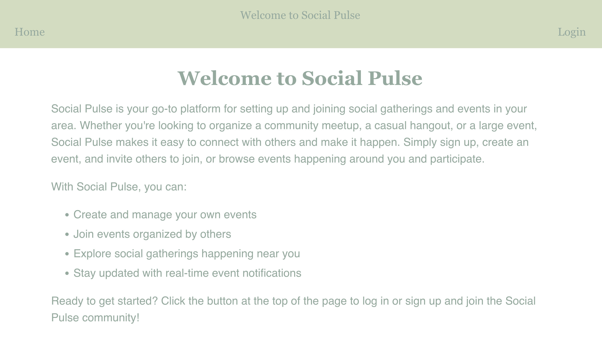
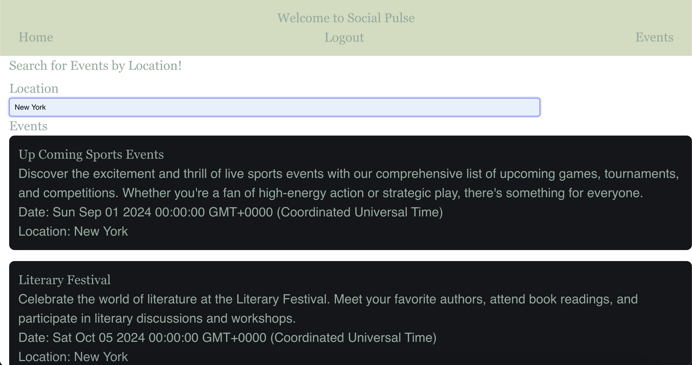

# Social-Pulse

## Description

"Social Pulse" is a web application that allows users to create and join social events at specific locations. Users can invite friends for activities such as hiking, organizing a pickup basketball game at a local park, and more. By posting events, users can share details like time, location, and description, making it easy for others to discover and participate.

Users can view a list of upcoming events and click on individual events to see more details. The application integrates the Google Maps API and Google Places API to provide accurate location data and enrich the user experience. These APIs are also used to seed our database with location information, ensuring that users can find and create events at real-world places effortlessly.

The creation of Social Pulse is a collaborative effort by students in the Columbia University Full-Stack Bootcamp. It aims to demonstrate the skills learned in the course, including using Node.js and Express.js to create a RESTful API, utilizing Handlebars.js as the template engine, and implementing PostgreSQL and the Sequelize ORM for the database. The project also involves creating both GET and POST routes for retrieving and adding new data, maintaining a folder structure that adheres to the MVC paradigm, and including authentication with express-session and cookies. Furthermore, the application protects API keys and sensitive information with environment variables, is deployed using Render with a connected database, and ensures a polished and responsive UI. By working on Social Pulse, students gain practical experience in full-stack development, database management, user authentication, and responsive design while enhancing their collaborative and problem-solving skills.

## Technologies Used

Technologies used in this project include Handlebars, CSS, Bulma, JavaScript, Node.js, Express.js, Sequelize, Bcrypt, and PostgreSQL.

## Screenshots

## Deployment Link:

https://social-pulse-x72y.onrender.com
